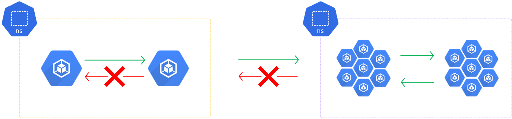
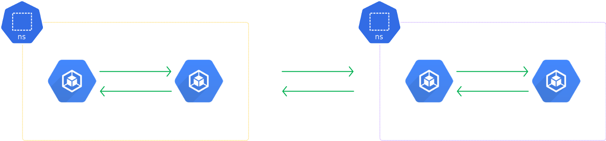
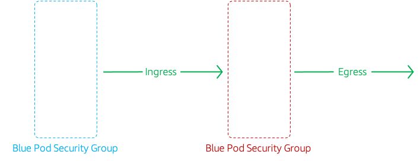
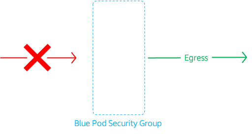
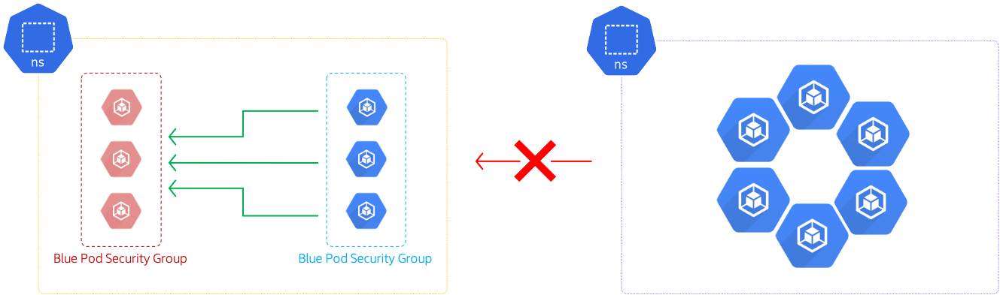
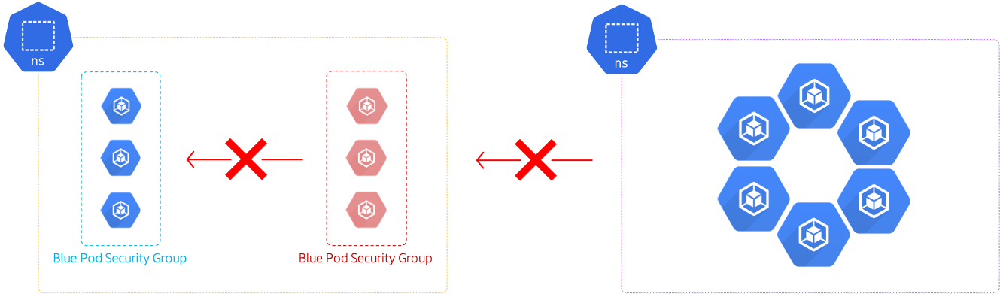

# Kubernetes Security with AWS Security groups

The developer at Mystique Unicorn are interested in building their application using event-driven architectural pattern to process streaming data. For those who are unfamiliar, _An event-driven architecture uses events to trigger and communicate between decoupled services and is common in modern applications built with microservices. An event is a change in state, or an update, like an item being placed in a shopping cart on an e-commerce website._

In this application, Kubernetes has been chosen as the platform to host their application producing and consuming events. The producers and consumers are maintained by different teams. They would like to isolate the traffic and have the ability to allow only the necessary traffic. Can you help them achieve this?



## 🎯 Solutions

By default, network traffic in a Kubernetes cluster can flow freely between pods and also leave the cluster network altogether.



Creating restrictions to allow only necessary service-to-service and cluster egress connections decreases the number of potential targets for malicious or misconfigured pods and limits their ability to exploit the cluster resources. AWS Security groups<sup>[1]</sup> for pods integrate Amazon EC2 security groups with Kubernetes pods. You can use Amazon EC2 security groups to define rules that allow inbound and outbound network traffic to and from pods that you deploy to nodes running on many Amazon EC2 instance types and Fargate. There are a number of limitations<sup>[2]</sup> with this approach, until the ecosystem evolves my recommendation is to use Kubernetes network policies to secure pod networks. For example, `t2` instance types does not not support this feature.

In this blog, I will show how to deploy a security group for pods.

1. ## 🧰 Prerequisites

   This demo, instructions, scripts and cloudformation template is designed to be run in `us-east-1`. With few modifications you can try it out in other regions as well(_Not covered here_).

   - 🛠 AWS CLI Installed & Configured - [Get help here](https://youtu.be/TPyyfmQte0U)
   - 🛠 AWS CDK Installed & Configured - [Get help here](https://www.youtube.com/watch?v=MKwxpszw0Rc)
   - 🛠 Python Packages, _Change the below commands to suit your OS, the following is written for amzn linux 2_
     - Python3 - `yum install -y python3`
     - Python Pip - `yum install -y python-pip`
     - Virtualenv - `pip3 install virtualenv`

1. ## ⚙️ Setting up the environment

   - Get the application code

     ```bash
     git clone https://github.com/miztiik/eks-security-with-security-group
     cd eks-security-with-security-group
     ```

1. ## 🚀 Prepare the dev environment to run AWS CDK

   We will use `cdk` to make our deployments easier. Lets go ahead and install the necessary components.

   ```bash
   # You should have npm pre-installed
   # If you DONT have cdk installed
   npm install -g aws-cdk

   # Make sure you in root directory
   python3 -m venv .venv
   source .venv/bin/activate
   pip3 install -r requirements.txt
   ```

   The very first time you deploy an AWS CDK app into an environment _(account/region)_, you’ll need to install a `bootstrap stack`, Otherwise just go ahead and deploy using `cdk deploy`.

   ```bash
   cdk bootstrap
   cdk ls
   # Follow on screen prompts
   ```

   You should see an output of the available stacks,

   ```bash
   eks-cluster-vpc-stack
   eks-cluster-stack
   ssm-agent-installer-daemonset-stack
   ```

1. ## 🚀 Deploying the application

   Let us walk through each of the stacks,

   - **Stack: eks-cluster-vpc-stack**
     To host our EKS cluster we need a custom VPC. This stack will build a multi-az VPC with the following attributes,

     - **VPC**:
       - 2-AZ Subnets with Public, Private and Isolated Subnets.
       - 1 NAT GW for internet access from private subnets

     Initiate the deployment with the following command,

     ```bash
     cdk deploy eks-cluster-vpc-stack
     ```

     After successfully deploying the stack, Check the `Outputs` section of the stack for the

   - **Stack: eks-cluster-stack**
     As we are starting out a new cluster, we will use most default. No logging is configured or any add-ons. The cluster will have the following attributes,

     - The control pane is launched with public access. _i.e_ the cluster can be access without a bastion host
     - `c_admin` IAM role added to _aws-auth_ configMap to administer the cluster from CLI.
     - One **OnDemand** managed EC2 node group created from a launch template
       - It create two `m5.large` instances running `Amazon Linux 2`.
       - Auto-scaling Group with `2` desired instances.
       - The nodes will have a node role attached to them with `AmazonSSMManagedInstanceCore` permissions
       - Kubernetes label `app:miztiik_on_demand_ng`

     The EKS cluster will be created in the custom VPC created earlier. Initiate the deployment with the following command,

     ```bash
     cdk deploy eks-cluster-stack
     ```

     After successfully deploying the stack, Check the `Outputs` section of the stack. You will find the `**ConfigCommand**` that allows yous to interact with your cluster using `kubectl`

   - **Stack: ssm-agent-installer-daemonset-stack**
     This EKS AMI used in this stack does not include the AWS SSM Agent out of the box. If we ever want to patch or run something remotely on our EKS nodes, this agent is really helpful to automate those tasks. We will deploy a daemonset that will _run exactly once?_ on each node using a cron entry injection that deletes itself after successful execution. If you are interested take a look at the daemonset manifest here `stacks/back_end/eks_cluster_stacks/eks_ssm_daemonset_stack/eks_ssm_daemonset_stack.py`. This is inspired by this AWS guidance.

     Initiate the deployment with the following command,

     ```bash
     cdk deploy ssm-agent-installer-daemonset-stack
     ```

     After successfully deploying the stack, You can connect to the worker nodes instance using SSM Session Manager.

1. ## 🔬 Testing the solution

   1. **Enable Pod ENI**

      To use security groups we need enable `CNI plugin` to manage network interfaces for pods by setting the `ENABLE_POD_ENI` variable to `true` in the `aws-node` DaemonSet.

      ```bash
      kubectl set env daemonset aws-node -n kube-system ENABLE_POD_ENI=true
      ```

      Confirm which of your nodes have `aws-k8s-trunk-eni` set to `true` with the following command, It may take a few minutes for the setting to take effect

      ```bash
      kubectl get nodes -o wide -l vpc.amazonaws.com/has-trunk-attached=true
      ```

      Expected output,

      ```bash
      NAME                                        STATUS   ROLES    AGE   VERSION              INTERNAL-IP   EXTERNAL-IP     OS-IMAGE         KERNEL-VERSION                CONTAINER-RUNTIME
      ip-10-10-0-160.eu-west-1.compute.internal   Ready    <none>   12h   v1.20.4-eks-6b7464   10.10.0.160   52.48.144.157   Amazon Linux 2   5.4.117-58.216.amzn2.x86_64   docker://19.3.13
      ip-10-10-1-102.eu-west-1.compute.internal   Ready    <none>   12h   v1.20.4-eks-6b7464   10.10.1.102   54.76.175.239   Amazon Linux 2   5.4.117-58.216.amzn2.x86_64   docker://19.3.13
      ```

   1. **Create the security groups**

      We need security groups to exist before deploying our pods, so lets create them. You can find the vpc id from outputs section of this stack `eks-cluster-vpc-stack` and update the variable in the below code segment. We will create two security groups,

      - `sgForBluePods` - Will not have any ingress rule. All Egress is allowed
      - `sgForRedPods` - Will have ingress rule to allow `ALL` traffic from `sgForBluePods`. All Egress is allowed.

      Note down the security group ids, we will used them to create security policy in the next section.

      ```bash
      VPC_ID="vpc-0e98e1ec9bf916556"

      # Create Blue Pod Security Group
      BLUE_POD_SG_ID=$(aws ec2 create-security-group \
         --group-name "sgForBluePods" \
         --description "security group for blue pods" \
         --vpc-id $VPC_ID \
         --query "GroupId" \
         --output text)

      echo $BLUE_POD_SG_ID

      # Create Red Pod Security Group
      RED_POD_SG_ID=$(aws ec2 create-security-group \
         --group-name "sgForRedPods" \
         --description "security group for red pods" \
         --vpc-id $VPC_ID \
         --query "GroupId" \
         --output text)

      echo $RED_POD_SG_ID

      # Allow Red SG to receive traffic from Blue
      aws ec2 authorize-security-group-ingress \
         --group-id $RED_POD_SG_ID \
         --protocol -1 \
         --port -1 \
         --source-group $BLUE_POD_SG_ID
      ```

   1. **Create Namespace**

      As network policies are namespaced resources, let us begin by creating a new namespace.

      ```bash
      kubectl apply -f miztiik-automation-ns.yml
      ```

   1. **Install EKS Security Group Policy**

      Let us create two EKS security policy, one for each our pods. The manifests are provided in the directory `stacks/k8s_utils/manifests`

      The following is the manifest for policy pods running with the `role:red`

      

      ````text
      apiVersion: vpcresources.k8s.aws/v1beta1
      kind: SecurityGroupPolicy
      metadata:
      name: allow-blue-to-red
      namespace: miztiik-automation-ns
      labels:
         dept: engineering
         team: red-shirts
         project: eks-security-with-security-groups
      spec:
      podSelector:
            matchLabels:
            role: red
      securityGroups:
            groupIds:
            - sg-0c65a538ef8abf584

            Deploy the policy `red-ingress-aws-security-policy.yml`

      ```bash
      kubectl apply -f red-ingress-aws-security-policy.yml
      ````

      Similarly, deploy the policy for pods running with the `role:blue`

      

      ```bash
      kubectl apply -f blue-ingress-aws-security-policy.yml
      ```

      Expected output,

      ```bash
      securitygrouppolicy.vpcresources.k8s.aws/allow-blue-to-red created
      securitygrouppolicy.vpcresources.k8s.aws/deny-ingress-for-blue created
      ```

   1. **Deploy Pods**

      We will create two pods,

      - pod name: `k-shop-red` with label `role:red`
      - pod name: `k-shop-blue` with label `role:blue`

      ```bash
      kubectl create -f pod_red.yml
      kubectl create -f pod_blue.yml
      ```

      Confirm pods are running and make a note of their IPs, we will use them later for testing.

      ```bash
      kubectl get pods -o wide -n miztiik-automation-ns
      ```

      Expected output,

      ```bash
      NAME          READY   STATUS    RESTARTS   AGE   IP            NODE                                        NOMINATED NODE   READINESS GATES
      k-shop-blue   1/1     Running   0          62s   10.10.1.74    ip-10-10-1-102.eu-west-1.compute.internal   <none>           <none>
      k-shop-red    1/1     Running   0          66s   10.10.0.118   ip-10-10-0-160.eu-west-1.compute.internal   <none>           <none>
      ```

   1. **Connect to Blue Pod To Test Red Ingress**

      Connect to the Blue pod and try to access red pod using _curl_ or _wget_

      

      ```bash
      kubectl -n miztiik-automation-ns exec --stdin --tty k-shop-blue -- /bin/bash
      ```

      You should land in the container shell, you can use curl for blue pod ip address. It should time out eventually.

      Expected output,

      ```bash
      root@k-shop-blue:/# curl 10.10.0.118
      <!DOCTYPE html>
      <html>
      <head>
      <title>Welc
      ```

      As you can see, you can reach the red pod. If you create a container in another namespace and try to reach the red pod, it will time out.

   1. **Connect to Red Pod To Test Blue Ingress**

      Connect to the Red pod and try to access Blue pod using _curl_ or _wget_

      

      ```bash
      kubectl -n miztiik-automation-ns exec --stdin --tty k-shop-red -- /bin/bash
      ```

      You should land in the container shell, you can use curl for red pod ip address,

      Expected output,

      ```bash
      root@k-shop-red:/# curl 10.10.1.74
      curl: (7) Failed to connect to 10.10.1.74 port 80: Connection timed out
      root@k-shop-red:/#
      ```

      As you can see, you cannot reach the blue pod. If you create a container in another namespace and try to reach the red pod, it will time out.

1. ## 📒 Conclusion

   Here we have demonstrated how to use AWS security group to secure pods. These recommendations provide a good starting point, but security policies are much more complicated, Use them after understanding all the limitations that come along with this feature.

1. ## 🧹 CleanUp

   If you want to destroy all the resources created by the stack, Execute the below command to delete the stack, or _you can delete the stack from console as well_

   - Resources created during [Deploying The Application](#-deploying-the-application)
   - Delete CloudWatch Lambda LogGroups
   - _Any other custom resources, you have created for this demo_

   ```bash
   # Delete from cdk
   cdk destroy

   # Follow any on-screen prompts

   # Delete the CF Stack, If you used cloudformation to deploy the stack.
   aws cloudformation delete-stack \
     --stack-name "MiztiikAutomationStack" \
     --region "${AWS_REGION}"
   ```

   This is not an exhaustive list, please carry out other necessary steps as maybe applicable to your needs.

## 📌 Who is using this

This repository aims to show how to use EKS Security group policies to secure AWS EKS to new developers, Solution Architects & Ops Engineers in AWS. Based on that knowledge these Udemy [course #1][102], [course #2][101] helps you build complete architecture in AWS.

### 💡 Help/Suggestions or 🐛 Bugs

Thank you for your interest in contributing to our project. Whether it is a bug report, new feature, correction, or additional documentation or solutions, we greatly value feedback and contributions from our community. [Start here](/issues)

### 👋 Buy me a coffee

[](https://ko-fi.com/Q5Q41QDGK) Buy me a [coffee ☕][900].

### 📚 References

1. [AWS Docs: Security groups for pods][1]
1. [AWS Docs: SG for pods Limitation][2]

### 🏷️ Metadata


**Level**: 200

[1]: https://docs.aws.amazon.com/eks/latest/userguide/security-groups-for-pods.html
[2]: https://docs.aws.amazon.com/eks/latest/userguide/security-groups-for-pods.html#security-groups-pods-considerations
[3]: https://docs.projectcalico.org/security/kubernetes-network-policy
[4]: https://github.com/ahmetb/kubernetes-network-policy-recipes
[100]: https://www.udemy.com/course/aws-cloud-security/?referralCode=B7F1B6C78B45ADAF77A9
[101]: https://www.udemy.com/course/aws-cloud-security-proactive-way/?referralCode=71DC542AD4481309A441
[102]: https://www.udemy.com/course/aws-cloud-development-kit-from-beginner-to-professional/?referralCode=E15D7FB64E417C547579
[103]: https://www.udemy.com/course/aws-cloudformation-basics?referralCode=93AD3B1530BC871093D6
[899]: https://www.udemy.com/user/n-kumar/
[900]: https://ko-fi.com/miztiik
[901]: https://ko-fi.com/Q5Q41QDGK
